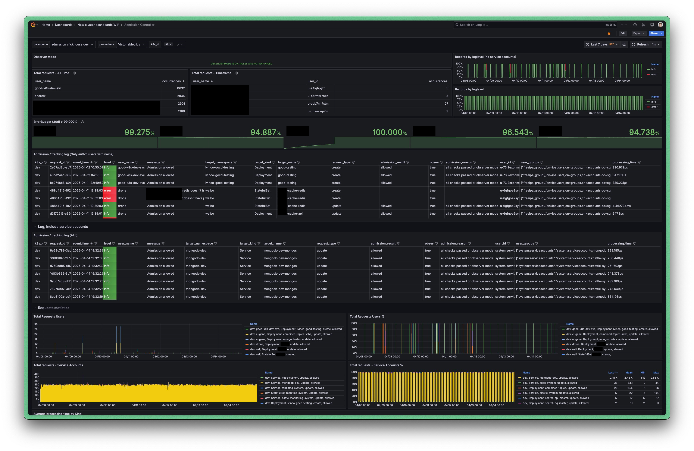

# kubernetes admission server
# UI example


## The Admission Controller

The Admission Controller is a security plugin that is deployed into the Kubernetes cluster. It intercepts API calls to the kube-api-server, checks them against a set of rules, and either admit the request and sends it to the kube API, or rejects it.
Original documentation covers everything there's to know about admission control in the k8s cluster, the documentation is pretty extensive and hard to consume. However, to know more about how those things work, see:
  * [A Guide to Kubernetes Admission Controllers](https://kubernetes.io/blog/2019/03/21/a-guide-to-kubernetes-admission-controllers/)
  * [Admission Controllers Reference](https://kubernetes.io/docs/reference/access-authn-authz/admission-controllers/)

## Admission Controller Phases

Two main abstractions we are going to use are ValidatingWebhookConfiguration and MutatingWebhookConfiguration. In the Mutating phase, the admission server can make some changes to the received object (Add default resource requests and limits, like ''LimitRanger'' does). In the Validating phase, it usually only approves or rejects the request.


## TRDL
### How to use it?
  * Deploy from GoCD, Admission-Controller pipeline.
  * All the namespaces are controlled by default
  * To disable admission control for a namespace, put a label ''admission-control=false''
```
kubectl label namespace <namespace> admission-control=false
```
  * To enable admission control for a namespace, remove the label or turn it into ''admission-control=true'' or remove the label completely

```
kubectl label ns <namespace> admission-control-
```
### How to configure it?
Use ''validatingwebhookconfigurations.admissionregistration.k8s.io object''.
It's manifest is located [here - ValidatingWebhookConfiguration](https://github.com/Ivinco/admission-controller/blob/main/.helm/charts/admission-controller/templates/30-validate-webhook.yaml).

### How to add new functions?
That's the most tricky part. Since the whole logic is written in Go, the only way to add new checks is in Go. The controller itself is placed [here](https://github.com/Ivinco/admission-controller/tree/main/admission-controller).

## Admission Controller at Ivinco

Currently, there are 5 checks configured for our admission controller.

  - Presence of probes (At least 1 probe of any type should be configured for any container in the pod)
  - Absence of `latest` image tags
  - imagePullPolicy != always
  - correct runAsUser
  - Service type != nodePort

## How it works
### Core
At the root level, we have defined some core structs.

In ''admission.go'' we have the main structs: ''AdmitFunc'' , ''Hook'', and ''Result''.

AdmitFunc is a function type that defines how to process an admission request. It is where you define the validations or mutations for a specific request. You will see some examples in deployments and pods packages.
```
type AdmitFunc func(request *admission.AdmissionRequest) (*Result, error)
```

Hook is representing the set of functions (AdmitFunc) for each operation in an admission webhook. When you create an admission webhook, either validating or mutating, you have to define which operations you want to intervene.
```
type Hook struct {
	Create  AdmitFunc
	Delete  AdmitFunc
	Update  AdmitFunc
	Connect AdmitFunc
}
```

In patch.go we have the struct and function for JSON patch operation.

PatchOperation represents a JSON patch operation.

A mutating admission webhook may modify the incoming object in the request. This is done using the JSON patch format. See JSON patch documentation for more details.

You can see a better example in the function mutateCreate inside the pods package, where we use PatchOperation to set an annotation to the pod and also, to add a sidecar container.
```
type PatchOperation struct {
	Op    string
	Path  string
	From  string
	Value interface{}
}
```

### Functions
All the operations available can be found in ''validation/checks.go''. It's 3 functions - decoding received object, checking for probes and checking for ''latest'' tag in the image.
```
func parseObject(object []byte) (*v1.ReplicaSet, error) {
	var objectToParse v1.ReplicaSet

	if err := json.Unmarshal(object, &objectToParse); err != nil {
		return nil, err
	}
	return &objectToParse, nil
}

func hasProbes(spec core.PodSpec) bool {
	for _, container := range spec.Containers {
		if container.ReadinessProbe == nil && container.LivenessProbe == nil && container.StartupProbe == nil {
			log.Errorf("Container %s doesn't have probes set", container.Name)
			return false
		}
	}
	return true
}

func checkImageLatest(spec core.PodSpec) bool {
	pattern := regexp.MustCompile(`:latest$`)
	for _, container := range spec.Containers {
		if pattern.MatchString(container.Image) {
			log.Errorf("Container %s is created with the following image: %s. `latest` tags are restricted. Please use specific image versions", container.Name, container.Image)
			return false
		}
	}
	return true
}
```
Validation procedure for each resource type is defined in ''validation/validate.go''. It's a switch statement, with every ''case'' being every resource type we need to check:
```
		switch kind {
		case "Deployment":
			deployment := &appsv1.Deployment{}
			err := runtime.DefaultUnstructuredConverter.FromUnstructured(unstructuredObj.Object, deployment)
			if err != nil {
				utils.InfoLog("Error converting unstructured to deployment: %s", err)
				return &admissioncontroller.Result{Msg: "Failed to convert object to deployment", Allowed: false}, nil
			}
			utils.DebugLog("Processing a Deployment named %s", deployment.ObjectMeta.Name)
			if !hasProbes(deployment.Spec.Template.Spec, logFields) {
				errorMessages = append(errorMessages, fmt.Sprintf("At least one container of Deployment %s does not have required probes", deployment.ObjectMeta.Name))
			}
			if !checkImageLatest(deployment.Spec.Template.Spec, logFields) {
				errorMessages = append(errorMessages, fmt.Sprintf("At least one container of Deployment %s uses tag `Latest`", deployment.ObjectMeta.Name))
			}

			if !checkImagePullPolicy(deployment.Spec.Template.Spec, logFields) {
				errorMessages = append(errorMessages, fmt.Sprintf("At least one container of Deployment %s uses imagePullPolicy `Always`", deployment.ObjectMeta.Name))
			}

```

They are invoked by sending a request to a specific location, described in ''http/server.go''
```
func NewServer(port string) *http.Server {
	// Instances hooks
	validation := validation.NewValidationHook()

	// Routers
	ah := newAdmissionHandler()
	mux := http.NewServeMux()
	mux.Handle("/healthz", healthz())
	mux.Handle("/validate", ah.Serve(validation))

	return &http.Server{
		Addr:    fmt.Sprintf(":%s", port),
		Handler: mux,
	}
}
```

### In Kubernetes cluster

The admission controller is deployed as a Helm chart with the tool called werf. GoCD pipeline is called Admission-Controller.  The whole CI pipeline for this application is located in the ''werfConverge.sh'' script. It basically converges the git repo state and the cluster state. Secret values, like certificates are located in ''.helm/admission-controller/secret-values.yaml''.


In the cluster the controller consists of the following elements:
  * admission-server ''deployment+service'' - the server itself
  * objects-validation ''validatingwebhookconfigurations.admissionregistration.k8s.io'' - a configuration that defines the admission rules and flows
  * admission-tls ''secret'' - TLS certificates, since the controller can not operate in plain HTTP.

The admission controller is configured to admit deployments and statefulsets created or updated in all the namespaces.

To check all the namespaces which are not enabled to work with the controller one can use the following command
```
# kubectl get ns -l admission-control=false
```

### Logging
The admission controller writes its logs to a clickhouse pod, that is deployed alongside with the controller.

## Certificates

There is a slight complexity with certificate generation. Simple certificate that rely on Common Name won't work with the admission controller. One should generate certificates with SAN's. Alternative names should be ''service-name.namespace.svc'' and ''service-name.namespace''

### How to generate
```
openssl genrsa -out ca.key 2048
openssl req -new -x509 -days 3650 -key ca.key -subj "/C=US/O=Acme, Inc./CN=Acme Root CA for Admission Controller" -out ca.crt
openssl req -newkey rsa:2048 -nodes -keyout server.key -subj "/C=US/O=Acme, Inc./CN=*.admission-server.admission-controller.svc" -out server.csr
openssl x509 -req -extfile <(printf "subjectAltName=DNS:admission-server.admission-controller,DNS:admission-server.admission-controller.svc") -days 3650 -in server.csr -CA ca.crt -CAkey ca.key -CAcreateserial -out server.crt
```

### How to use

To update certificates or CA you need to update them in the [repo](https://github.com/Ivinco/admission-controller) in [this](https://github.com/Ivinco/admission-controller/blob/main/.helm/charts/admission-controller/secret-values.yaml) file.

CA update may be performed in the cluster directly:

```
kubectl edit validatingwebhookconfigurations.admissionregistration.k8s.io objects-validation
```
You need to find ''webhook.clientConfig.cdBundle'' field and paste base64 encoded CA certificate there. It looks will look like that:
```
apiVersion: admissionregistration.k8s.io/v1
kind: ValidatingWebhookConfiguration
metadata:
  annotations:
    meta.helm.sh/release-name: ivinco-admission-controller
    meta.helm.sh/release-namespace: admission-controller
    project.werf.io/env: ""
    project.werf.io/name: admission-controller
    werf.io/version: v1.2.214+fix3
  labels:
    app.kubernetes.io/managed-by: Helm
  name: objects-validation
webhooks:
- admissionReviewVersions:
  - v1
  clientConfig:
    caBundle: LS0tLS1C...JRklDQVRFLS0tLS0K
    ...
    ...
    ...
```
### Update in repo
To update the secret values in the repo, one need to use utility called werf. If not installed, please install it from [official werf website](https://ru.werf.io/documentation/v1.2/).
Once the tool is installed, you can use the following command to edit secret values:

```
# Clone repo and enter repo directory
$ git clone git@github.com:Ivinco/admission-controller.git
$ cd admission-controller

# Create a new branch
$ git checkout -b new-branch

# Find werf secret key in lastpass and export it
$ export WERF_SECRET_KEY='secret key content'

# edit values
$ user@host:admission-controller$ werf helm secret values edit .helm/charts/admission-controller/secret-values.yaml
```

### If something goes wrong
If the admission controller for some reason works not as expected, there are two ways of disabling it:
  - unlabel all the namespaces wiht ''kubectl label ns <ns-name> admission-control=false''
  - remove ''validatingwebhookconfigurations'' object named ''objects-validation'' and if present ''track-all''

### Licence
Core abstractions and understanding is forked from https://github.com/douglasmakey/admissioncontroller
